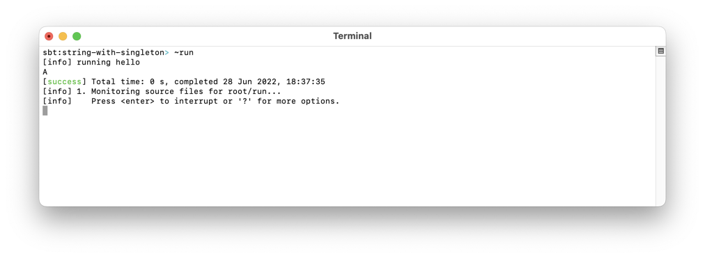

## String with Singleton

Use [Scastie](https://scastie.scala-lang.org/), or [Install Scala](https://docs.scala-lang.org/getting-started/).

The key part is `String with Singleton`, as shown in [Main.scala](./src/main/scala/Main.scala):

	def developerDefinedStringsOnly(str: String with Singleton) =
	  println(str)

	@main def hello: Unit =
	  developerDefinedStringsOnly("A")
	  // developerDefinedStringsOnly("B".trim)

And when you un-comment the non-literal-string:

Note how the error finds a String, when it requires a "String & Singleton".

Thanks to [Tamer Abdulradi](https://twitter.com/tabdulradi)